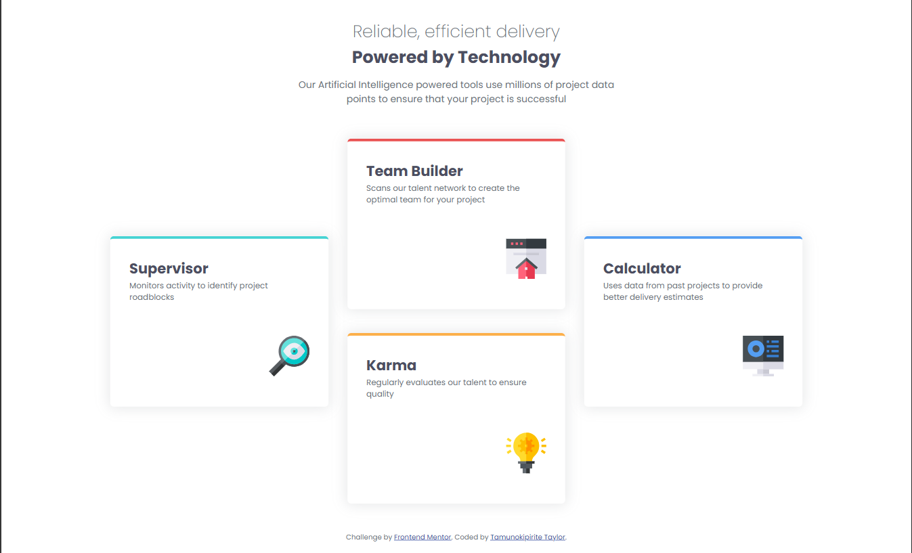
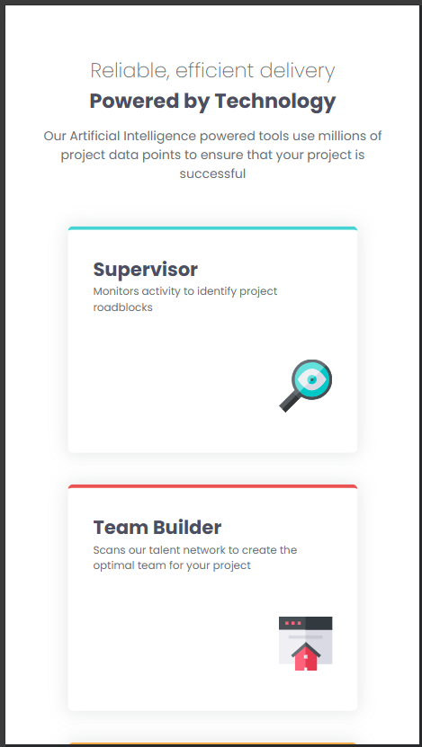
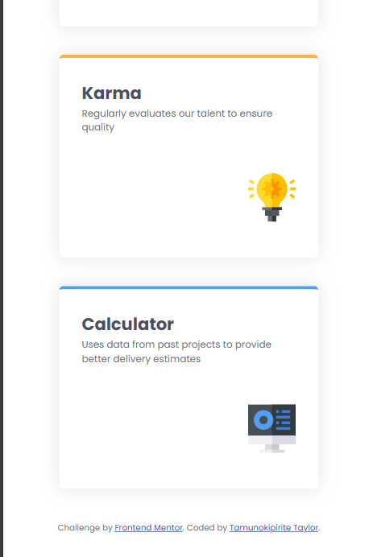

# Frontend Mentor - Four card feature section solution

This is a solution to the [Four card feature section challenge on Frontend Mentor](https://www.frontendmentor.io/challenges/four-card-feature-section-weK1eFYK). Frontend Mentor challenges help you improve your coding skills by building realistic projects.

## Table of contents

- [Overview](#overview)
  - [The challenge](#the-challenge)
  - [Screenshot](#screenshot)
  - [Links](#links)
- [My process](#my-process)
  - [Built with](#built-with)
  - [What I learned](#what-i-learned)
  - [Continued development](#continued-development)
  - [Useful resources](#useful-resources)
- [Author](#author)
- [Acknowledgments](#acknowledgments)

**Note: Delete this note and update the table of contents based on what sections you keep.**

## Overview

A four card section solution.

### The challenge

Users should be able to:

- View the optimal layout for the site depending on their device's screen size

### Screenshot

Desktop View


Mobile View 1


Mobile View 2


### Links

- Solution URL: [Add solution URL here](https://your-solution-url.com)
- Live Site URL: [Add live site URL here](https://your-live-site-url.com)

## My process

I approached this using a mobile first approach. I got the design of the boxes and then figured out how to design the whole page. Lastly, using relative and absolute positioning, I positioned the images. Then I went ahead to design the desktop version.

### Built with

- Semantic HTML5 markup
- CSS custom properties
- Flexbox
- CSS Grid
- Mobile-first workflow

### What I learned

I learnt to manipute the flow of grid to change the order in which items are being placed

```css
#cards {
  display: grid;
  grid-template-columns: repeat(3, 1fr);
  grid-template-rows: 1fr 1fr;
  grid-auto-flow: column;
  column-gap: 0rem;
  max-width: 75rem;
  margin: 0 auto;
}
```

### Continued development

Continue focus on how develop the exact replica of designs.
